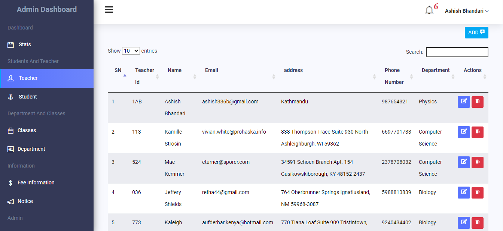
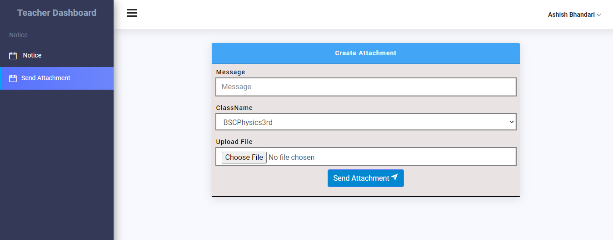
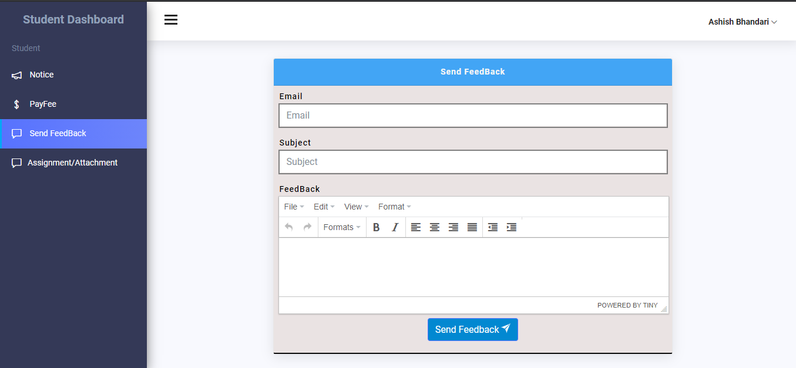

# School Management System

## Installation

```bash
cp .env.example .env
```

### configure your database credentials and install dependencies

```bash
composer install
```

### Generate application key.

```bash
php artisan key:generate
```

### Migrate and Seed fake data on database.

```bash
php artisan migrate:fresh --seed
```

### start server by specifying port and host

```bash
php artisan serve
```

### If you want to start server on port other than 8080

```bash
php artisan serve --host=0.0.0.0 --port=1212
```

### or

```bash
php -S localhost:1212 -t public/
```

# Features

-   Role based Login.
-   Admin Login , Student Login and Teacher Login.

*   Admin can create students, teachers.
*   Admin can create classes and department.
*   Admin can create notice for both student and teachers.
*   Admin can view fee information.

*   Teacher can view notification sent by admin and send attachment and assign to specific class.
*   Paypal Integration for student fee payment.
*   Student can send mail to admin for sending feedback from application.

*   Every Role can edit their profile
*   notification system

> Admin dashboard
> 

> teacher dashboard
> 

> student dashboard
> 
